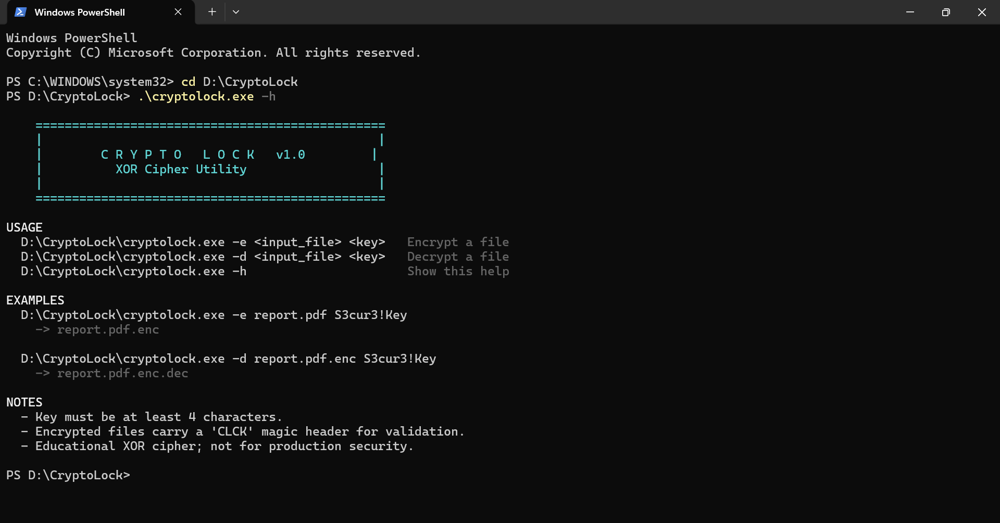
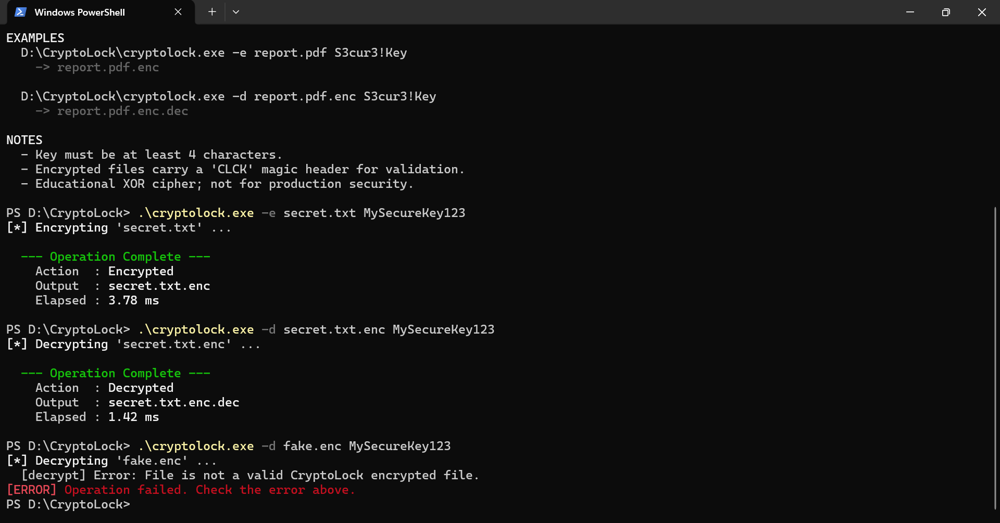

# CryptoLock 🔐 (C++ File Encryption Utility)

This is my Summer Workshop Project for my BCA degree. I wanted to move beyond standard CRUD applications and dive deeply into low-level system operations, memory management, and binary file I/O. 

CryptoLock is a highly optimized, cross-platform command-line utility that securely encrypts and decrypts files. To truly challenge myself and understand how data is manipulated at the byte level, I strictly avoided external cryptography libraries like OpenSSL. Instead, I engineered a custom encryption engine using bitwise operations (XOR ciphering) and key-stretching algorithms from scratch.

## 📸 Project Previews

### The Command Line Interface


### Performance Benchmarking & Security Validation


## 🛠️ Tech Stack & Systems Architecture
* **Language:** Core C++ (C++11/C++17)
* **Paradigm:** Strict Object-Oriented Programming (OOP)
* **Performance:** Utilizes `<chrono>` for precise millisecond benchmarking. Memory-efficient 4KB chunking prevents `std::bad_alloc` on massive files.
* **File I/O:** Utilizes `<fstream>` for reading/writing raw binary data streams safely, ensuring media and executable files are not corrupted.
* **Low-Level Logic:** Heavy use of bitwise operators (`^`, `<<`, `>>`) for direct byte-level data manipulation.

## 🛡️ Security Guardrails & Edge Case Handling
* **Magic Header (`CLCK`):** Implements a custom 4-byte file signature embedded at the top of every encrypted file. During decryption, the engine reads the first 4 bytes and instantly rejects any file lacking this signature, preventing memory corruption or garbled output.
* **Same-Path Guard:** Prevents fatal data corruption by rejecting operations where the input and output paths resolve to the same file.
* **Defense in Depth:** Enforces strict key validation at both the CLI entry point and inside the engine core.
* **Graceful Cleanup:** Features automatic partial-file cleanup (`std::remove`) if a binary stream operation fails or crashes midway.

## ⚙️ How It Works under the Hood
1. **Command Line Parsing:** The user executes the compiled binary in the terminal, passing flags (`-e` for encrypt, `-d` for decrypt), the target file path, and a secret string key.
2. **Binary Stream Processing:** CryptoLock opens the target file in strictly binary mode (`std::ios::binary`) to ensure images, audio, or executables are read exactly byte-by-byte.
3. **The Cipher Engine:** The program streams the file contents through a custom OOP encryption class. It performs a bitwise XOR operation between the file's raw bytes and a dynamically 64-round stretched key. 
4. **Chunking:** Data is processed in 4096-byte (4KB) chunks, keeping RAM usage nearly zero, regardless of whether the file is 1MB or 10GB.

## 🚀 Build & Run Instructions
Because this project is built using strictly Standard C++, it compiles natively across all major operating systems without third-party dependencies.

### For Windows (PowerShell)
```powershell
.\build.ps1 rebuild
.\cryptolock.exe -h
```

### For Linux / macOS
```bash
make
./cryptolock -h
```

## 👨‍💻 Author
**Saurav Pandey**
* LinkedIn: [linkedin.com/in/5auravpandey](https://www.linkedin.com/in/5auravpandey)
* GitHub: [@5auravpandey](https://github.com/5auravpandey)
* Program: Bachelor of Computer Applications (BCA)
